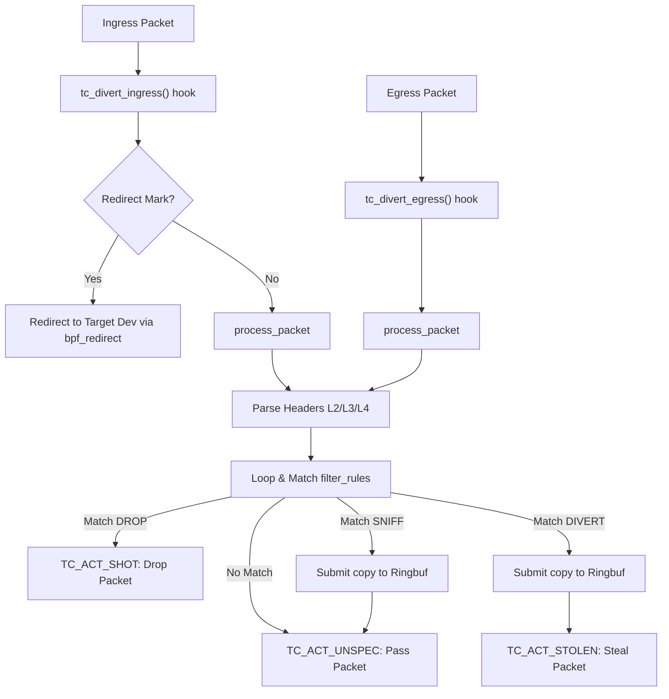

# eBPFDivert Architecture

**eBPFDivert** provides a high-performance packet capture, modification, and injection engine for Linux using the **eBPF (Extended Berkeley Packet Filter)** Traffic Control (TC) subsystem. This document details the inner workings of the driver, kernel-side packet routing, loop prevention, and user-space libraries.

---

## 1. Kernel-Side Hooks & Routing

`ebpfdivert` intercepts packets by registering eBPF programs as class-less queuing discipline (qdisc) classifiers at the **Traffic Control (TC)** layer.

### Ingress Hook: `tc_divert_ingress`
Hooks into network interfaces (e.g., `eth0`) at ingress. 
- If the packet carries the `REDIRECT_MARK_MASK` in its socket mark (`skb->mark`), it is extracted and routed directly to the destination interface via `bpf_redirect`.
- Otherwise, the packet undergoes rule evaluation.

### Egress Hook: `tc_divert_egress`
Hooks into interfaces at egress. Packs are parsed and run through rule evaluation immediately.

---

## 2. BPF Maps & Data Structures

`ebpfdivert` uses seven BPF maps pinned in `/sys/fs/bpf/ebpfdivert/` to communicate between kernel space and user space:

### 1. `pcap_ringbuf` (`BPF_MAP_TYPE_RINGBUF`)
A lockless ring buffer used for high-speed packet transfers from the kernel to user-space. Intercepted packets are submitted as a `divert_packet_buffer` structure containing packet metadata and payload.

### 2. `filter_rules` & `filter_rules_ipv6` (`BPF_MAP_TYPE_ARRAY`)
Fixed-size arrays containing active IPv4/generic rules and IPv6 rules respectively (maximum 64 rules per map). Rule matching is performed sequentially from index `0` to `63`. If a rule has the `MATCH_LPM_TRIE` flag set in its matching mask, the IP address check is delegated to the LPM Trie maps instead of evaluating the rule's local IP and mask fields.

### 3. `ipv4_lpm_trie` & `ipv6_lpm_trie` (`BPF_MAP_TYPE_LPM_TRIE`)
Longest Prefix Match (LPM) Tries mapping IP prefix keys (subnets CIDR) to action masks. Used to achieve $O(\log N)$ matching time complexity when evaluating large sets of IP subnets.

### 4. `stats_map` (`BPF_MAP_TYPE_PERCPU_ARRAY`)
A per-CPU stats array storing real-time metrics to prevent locking overhead. Key metrics include:
- `STAT_DIVERTED`: Count of stolen packets.
- `STAT_DROPPED`: Count of discarded packets.
- `STAT_SNIFFED`: Count of sniffed (copied) packets.
- `STAT_PARSING_ERR`: Count of protocol parser/skb errors.
- `STAT_RINGBUF_FULL`: Ring buffer overflows.
- `STAT_QUEUE_FULL`: User-space packet queue overflows.

### 5. `config_map` (`BPF_MAP_TYPE_ARRAY`)
Stores configuration parameters for the driver (such as current handle priority, loop prevention mark, and snaplen).

---

## 3. Loop Prevention and Chaining

To support multiple applications concurrently capturing packets on the same system, `ebpfdivert` implements **TC Chaining** and a **Priority-Aware Loop Prevention** mechanism:

1. **Re-injection Priority Mark**:
   When user-space re-injects a packet via `ebpfdivert_send()`, it marks the packet with a priority-aware socket mark:
   $$\text{Socket Mark} = \text{PREVENT\_MARK} \mid (\text{priority} \ \& \ \text{0xFFFF})$$
2. **BPF Evaluation**:
   When the BPF program sees a packet containing `PREVENT_MARK` in `skb->mark`, it extracts the `inject_priority`.
   - If the current classifier's priority is **higher or equal** (expressed as a lower integer value) than the `inject_priority`, the packet is skipped (`TC_ACT_UNSPEC`), avoiding recursive captures.
   - If the current classifier's priority is **lower** (larger integer value), it is allowed to capture it, creating a priority-based handle chain.

---

## 4. User-Space Queueing and Backpressure

Because ring buffer allocations are finite, user-space must process packets quickly. `libebpfdivert` implements a built-in FIFO packet queue to handle bursts of packets:

- **Ring Buffer Poll**: The C library polls `pcap_ringbuf` via `ring_buffer__poll()`.
- **FIFO Queueing**: When a packet is read from the ring buffer, if the application is not actively calling `recv`, the library pushes the packet onto an internal memory queue.
- **Backpressure & Drop**: If the queue exceeds `max_queue_size` (default `1024`), incoming packets are dropped, and `STAT_QUEUE_FULL` is incremented.
- **Tuning**: The backpressure threshold can be adjusted at runtime using `ebpfdivert_set_max_queue_size()`.
